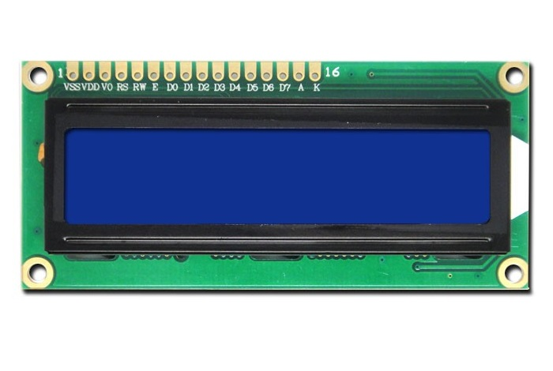

# Utilizacion de Módulos y Componentes

| Dispositivo                                                                | Documentación                                                 |
| -------------------------------------------------------------------------- | ------------------------------------------------------------- |
|                   | [Pantalla LCD](./pantalla_lcd.md)                             |
|  | [Sensores de humedad de suelo](./sensor_humedad_suelo.md)     |
|               | [Sensor de humedad relativa y temperatura](./sensor_dht11.md) |
