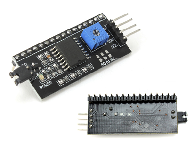
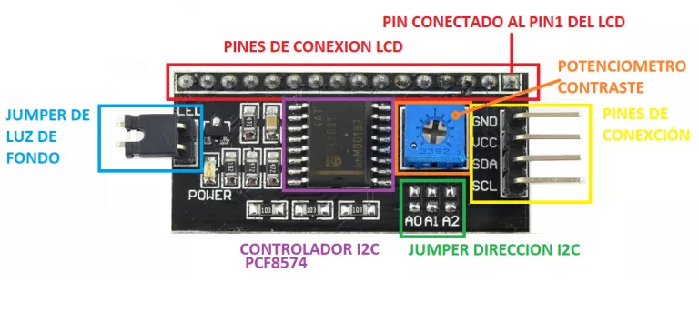
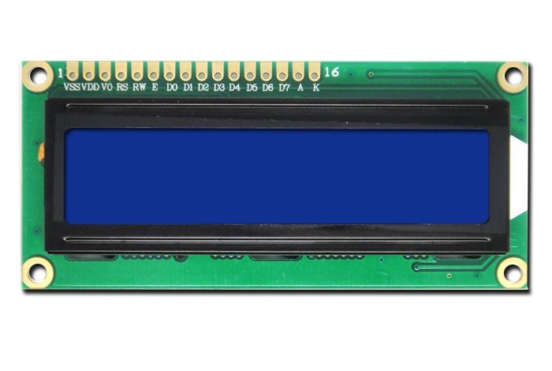
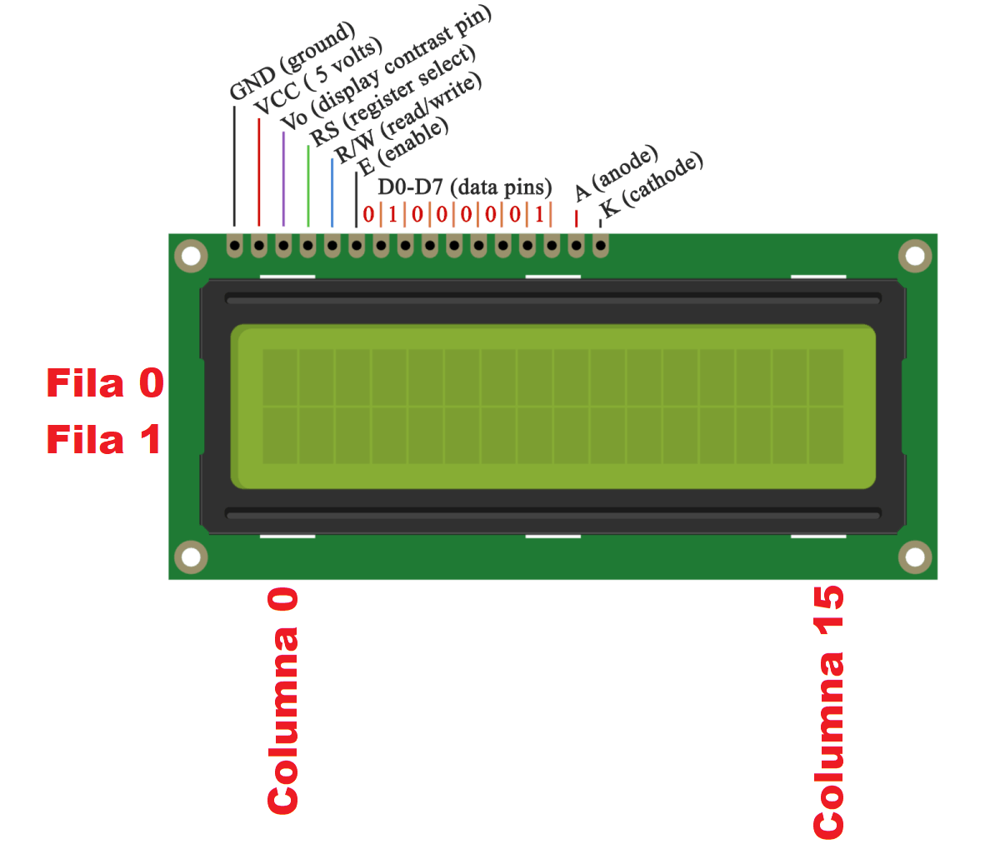
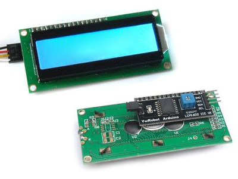
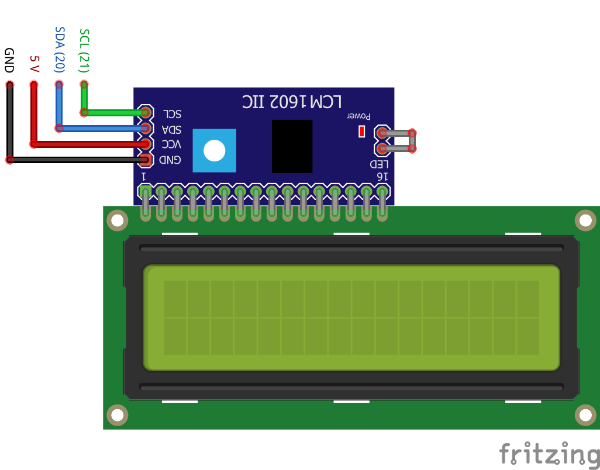

# Utilización de la Pantalla LCD

Utilizaremos una pantalla LCD de 16x2 para desplegar información respecto a las lecturas obtenidas por los sensores y mensajes de estado de las operaciones realizadas por el sistema.

## Materiales

Para realizar la conexión con la placa Arduino Mega, necesitaremos:

- 1 Módulo Adaptador Serial I2C para pantallas LCD
- 1 Pantalla Alfanumérica LCD de 16x2
- 4 Cables tipo Dupont Macho - Hembra

### Módulo Adaptador Serial I2C para pantallas LCD

Esta basado en el [PCF8574](#pcf8574), el cual es un Expansor de Entradas y Salidas digitales controlado por I2C, que permite conectar la pantalla al Arduino usando solamente dos lineas digitales a través del [bus I2C](#bus-i2c).

<figure style="text-align: center">
    
    <figcaption style="text-align: center">Módulo adaptador LCD a I2C</figcaption>
</figure>

#### Descripción

<figure style="text-align: center">
    
    <figcaption style="text-align: center">Pines Módulo adaptador LCD a I2C</figcaption>
</figure>

##### Configuración de los Pines

- **Pines de conexión LCD**, el adaptador LCD a I2C tiene los pines ordenados para conectar directamente al LCD, esto lo podemos hacer a través de un protoboard o soldando directamente al LCD.
- **Potenciometro contraste**, para controlar el contraste de los dígitos en el LCD solo necesitamos girar el potenciómetro que se encuentra en el módulo, hasta quedar conformes con el contraste mostrado.
- **Jumper de luz de fondo**, la luz de fondo se controla principalmente por software desde la placa Arduino, pero el módulo también permite desconectar el Led de la luz de fondo removiendo un jumper LED.
- **Pines de conexión**, para conectar con el modulo con el Arduino solo utilizamos los pines I2C de la placa (SDA y SCL) y alimentación (GND y 5V), los pines I2C varían de acuerdo al modelo de Arduino con el que trabajemos, en la siguiente tabla podemos ver cuales son los pines I2C para cada modelo de Arduino.

  | Adaptador I2C para LCD | Arduino Uno, Nano, Mini | Arduino Mega, DUE | Arduino Leonardo |
  | ---------------------- | ----------------------- | ----------------- | ---------------- |
  | GND                    | GND                     | **_GND_**         | GND              |
  | VCC                    | 5V                      | **_5V_**          | 5V               |
  | SDA                    | A4                      | **_20_**          | 2                |
  | SCL                    | A5                      | **_21_**          | 3                |

- **Controlador I2C (PC8574 o PC8574A)**, existen dos versiones de este adaptador que funcionan con direcciones del bus I2C diferentes, según el circuito integrado empleado.
- **Jumper dirección I2C**, cómo la comunicación se realiza en el bus I2C se necesita una dirección para poder acceder a él y enviar la información necesaria para visualizar datos en la pantalla, esta dirección se puede identificar con la siguiente tabla:

  | A0  | A1  | A2  | PCF8574    | PCF8574A |
  | --- | --- | --- | ---------- | -------- |
  | 0   | 0   | 0   | **_0X27_** | 0X3F     |
  | 0   | 0   | 1   | 0X26       | 0X3E     |
  | 0   | 1   | 0   | 0X25       | 0X3D     |
  | 0   | 1   | 1   | 0X24       | 0X3C     |
  | 1   | 0   | 0   | 0X23       | 0X3B     |
  | 1   | 0   | 1   | 0X22       | 0X3A     |
  | 1   | 1   | 0   | 0X21       | 0X39     |
  | 1   | 1   | 1   | 0X20       | 0X39     |

  Sin embargo estos jumpers son soldables para realizar la selección de dirección en el bus I2C, permitiendo que pueden coexistir varios de estos módulos en el mismo bus I2C.

#### Más Información

- [Módulo adaptador serial I2C para pantalla LCD de 16×2 o 20x4 caracteres | Tecnopura](https://www.tecnopura.com/producto/modulo-adaptador-serial-i2c-para-pantalla-lcd-de-16x2-o-20x4-caracteres/)
- [Adaptador pantalla LCD 16x2 serial I2C PCF8574 - Geek Factory](https://www.geekfactory.mx/tienda/pantallas-y-displays/adaptador-pantalla-lcd-16x2-serial-i2c-pcf8574/)
- [Módulo I2C para LCD - Geekbot Electronics](https://geekbotelectronics.com/tienda/producto/modulo-i2c-para-lcd/)

### Pantalla LCD 16x2

El LCD (Liquid Crystal Dysplay) o pantalla de cristal líquido es un dispositivo empleado para la visualización de contenidos o información de una forma gráfica, mediante caracteres, símbolos o pequeños dibujos dependiendo del modelo.

Una pantalla LCD de 16x2 significa que puede mostrar 16 caracteres por línea y hay 2 de esas líneas. En esta pantalla LCD, cada dígito se muestra en una matriz de 5x7 píxeles.

La pantalla LCD tiene dos registros, a saber, Comando y Datos.

- El **registro de comando** almacena las instrucciones de comando dadas a la pantalla LCD. Un comando es una instrucción dada a la LCD para realizar una tarea predefinida, como inicializarla, borrar su pantalla, establecer la posición del cursor, controlar la visualización, etc.
- El **registro de datos** almacena los datos que se mostrarán en la pantalla LCD. Los datos son el valor ASCII del carácter que se mostrará en la pantalla LCD.

<figure style="text-align: center">
    
    <figcaption style="text-align: center">LCD 16x2</figcaption>
</figure>

#### Descripción

<figure style="text-align: center">
    
    <figcaption style="text-align: center">Pines LCD 16x2</figcaption>
</figure>

- **_Pines de alimentación_**
  - **_VSS_**: GND
  - **_VDD_**: +5V
  - **_V0_**: corresponde al pin de contraste.
- **_Pines de control_**
  - **_RS_**: Corresponde al pin de selección de registro de control de datos (0) o registro de datos (1). Es decir el pin RS funciona paralelamente a los pines del bus de datos. Cuando RS es 0 el dato presente en el bus pertenece a un registro de control/instrucción y cuando RS es 1 el dato presente en el bus de datos pertenece a un registro de datos o un carácter.
  - **_RW_**: Corresponde al pin de Escritura (0) o de Lectura (1). Nos permite escribir un dato en la pantalla o leer un dato desde la pantalla.
  - **_E_**: Corresponde al pin Enable o de habilitación. Si E (0) esto quiere decir que el LCD no esta activado para recibir datos, pero si E (1) se encuentra activo y podemos escribir o leer desde el LCD.
- **_Pines de Bus de datos_**
  El Bus de datos bidireccional comprende desde los pines D0 a D7. Para realizar la comunicación con el LCD podemos hacerlo utilizando los 8 bits del bus de datos(D0 a D7) o empleando los 4 bits mas significativos del bus de datos(D4 a D7). En este caso vamos a explicar la comunicación con el bus de 4 bits.
- **_Iluminación led_**
  - **_A_** y **_K_**: Ánodo y Cátodo respectivamente.

#### Más Información

- [Pantalla LCD Alfanumerica 16x2 con Modulo I2C](https://tienda.sawers.com.bo/pantalla-lcd-16x2-incluye-modulo-i2c)
- [TodoElectrodo: Lcd 16x2](http://todoelectrodo.blogspot.com/2013/02/lcd-16x2.html)
- [Tutorial Innobot o Arduino – Pantalla LCD - Pygmalion Tech](https://pygmalion.tech/tutoriales/arduino-pantalla-lcd/#code1530129537059)

## Circuito y Montaje

Para utilizar el LCD 16×2 por I2C con Arduino Mega el primer paso es soldar el adaptador I2C en la parte de trasera de la pantalla. Al finalizar la soldadura, nuestro adaptador debe verse de la siguiente manera:

<figure style="text-align: center">
    
    <figcaption style="text-align: center">Adaptador I2C soldado a LCD</figcaption>
</figure>

Si no queremos soldar el adaptador a la pantalla, podemos utilizar un protoboard para realizar la conexión entre ambas piezas.

Una vez que tenemos soldado el adaptador I2C, hay que identificar los pines de I2C en la tarjeta Arduino que estemos usando. En el Arduino Mega, los pines del bus I2C corresponden con los pines 20 y 21.

<figure style="text-align: center">
    
    <figcaption style="text-align: center">Conexión I2C para LCD</figcaption>
</figure>

## Programación

Para comunicarse con dispositivos I2C es necesario contar con la libreria **_Wire_**, que viene instalada por defecto con el IDE de Arduino.

Para usar el LCD 16×2 por I2C con una placa Arduino es necesario también [instalar la librería](https://www.geekfactory.mx/tutoriales/tutoriales-arduino/como-instalar-una-libreria-de-arduino/): **_LiquidCrystal_I2C_** de forma que la placa Arduino sepa como comunicarse con el chip PCF8574.

### Libreria LiquidCrystal_I2C

La librería es **_LiquidCrystal_I2C_** dispone de métodos similares (algunos idénticos) a los de la librería oficial (**_LiquidCrystal_**).

A continuación algunas de las funciones principales:

- **LiquidCrystal_I2C(direccion, columnas, filas)**
  Función constructor, crea un objeto de la clase LiquidCrystal_I2C, con la dirección del bus I2C, cantidad de columnas y filas de la pantalla.
- **init()**
  Inicializa el modulo adaptador LCD a I2C, esta función internamente configura e inicializa el I2C y el LCD.
- **backlight()**
  Enciende la Luz del Fondo del LCD.
- **noBacklight()**
  Apaga la Luz del Fondo del LCD
- **clear()**
  Borra la pantalla LCD y posiciona el cursor en la esquina superior izquierda (posición (0,0)).
- **setCursor(fila, columna)**
  Posiciona el cursor del LCD en la posición indicada por fila y columna (x, y); es decir, establecer la ubicación en la que se mostrará posteriormente texto escrito para la pantalla LCD.
- **print()**
  Escribe un texto o mensaje en el LCD, su uso es similar a un Serial.print().

### Código

```c++
#include <Wire.h>
#include <LiquidCrystal_I2C.h>

// ...

/*
    lcd - es el nombre del objeto que creamos con el constructror
    para poder controlar la LCD
*/
LiquidCrystal_I2C lcd(0x27, 16, 2);

// ...

void setup()
{
    // ...

    lcd.init();
    lcd.backlight();

    //    ...
}

void loop()
{
    lecturasSensores(mumeroLecturasParaObtenerPromedio, valorLecturaTierraSeca);

    if (promedioPorcentajesSHS1 >= porcentajeMinimoSHS1 && promedioPorcentajesSHS1 <= porcentajeMaximoSHS1)
    {
        // ...

        lcd.setCursor(2, 0);
        lcd.print("BOMBA AGUA 1");
        lcd.setCursor(2, 1);
        lcd.print("ACTIVANDO " + String(tiempoRiegoSHS1 / 1000) + "s");

        // ...
    }

    if (promedioPorcentajesSHS2 >= porcentajeMinimoSHS2 && promedioPorcentajesSHS2 <= porcentajeMaximoSHS2)
    {
        // ...

        lcd.setCursor(2, 0);
        lcd.print("BOMBA AGUA 2");
        lcd.setCursor(2, 1);
        lcd.print("ACTIVANDO " + String(tiempoRiegoSHS2 / 1000) + "s");

        // ...
    }

    // ...
}

void lecturasSensores(int numeroLecturas, float valorLecturaTierraSeca)
{
   if (millis() - tiempoMilisegundos >= tiempoEntreLecturasPromediadas || tiempoMilisegundos == 0)
   {
        // ...

        lcd.clear();
        lcd.setCursor(4, 0);
        lcd.print("LEYENDO");
        lcd.setCursor(2, 1);
        lcd.print("SENSORES...");

        // ...

        if (miArchivo)
        {
            if (lecturasSensorHRTSonValidas)
            {
                // ...

                lcd.clear();
                lcd.setCursor(3, 0);
                lcd.print("GUARDANDO");
                lcd.setCursor(3, 1);
                lcd.print("REGISTRO...");

                // ...
            }

            // ...

        }
        else
        {
            // ...
        }
        lcd.clear();
        lcd.setCursor(0, 0);
        if (lecturasSensorHRTSonValidas)
        {
            lcd.print(String(int(humedadRelativa)) + "HR  " + String(int(temperaturaCelcius)) + "C  " + String(int(temperaturaFarentheit)) + "F");
        }
        else
        {
            lcd.print("HUMEDAD SUELO");
        }
        lcd.setCursor(0, 1);
        lcd.print("S1:" + String(int(promedioPorcentajesSHS1)) + "%");
        lcd.setCursor(9, 1);
        lcd.print("S2:" + String(int(promedioPorcentajesSHS2)) + "%");
   }
}

```

## Referencias

[Arduino lcd i2c | Código Electrónica](http://codigoelectronica.com/blog/arduino-lcd-i2c#modulo-lcd-i2c)
[Conectar un display LCD Hitachi a Arduino por bus I2C](https://www.luisllamas.es/arduino-lcd-i2c/)
[Tutorial LCD con I2C, controla un LCD con solo dos pines](https://naylampmechatronics.com/blog/35_tutorial-lcd-con-i2c-controla-un-lcd-con-solo-dos-pines.html)
[LCD 16x2 por I2C con Arduino usando solo dos pines - Geek Factory](https://www.geekfactory.mx/tutoriales/tutoriales-arduino/lcd-16x2-por-i2c-con-arduino/)

### Librerias

- [Wire](https://www.arduino.cc/en/reference/wire)
- [LiquidCrystal I2C](https://www.arduino.cc/reference/en/libraries/liquidcrystal-i2c/)
- [LiquidCrystal](https://www.arduino.cc/en/Reference/LiquidCrystal)

### PCF8574 {#pcf8574}

- [PCF8574: sobre el expansor E/S I2C para Arduino | Hardware libre](https://www.hwlibre.com/pcf8574/#Que_es_el_PCF8574)
- [Módulo expansor IO PCF8574](https://naylampmechatronics.com/interfaz-de-usuario/359-modulo-expansor-io-pcf8574.html)

### Bus I2C {#bus-i2c}

- [PCF8574: sobre el expansor E/S I2C para Arduino | Hardware libre](https://www.hwlibre.com/pcf8574/#Que_es_el_bus_I2C)
- [Descripción y funcionamiento del Bus I2C | Robots Didácticos](http://robots-argentina.com.ar/didactica/descripcion-y-funcionamiento-del-bus-i2c/)
