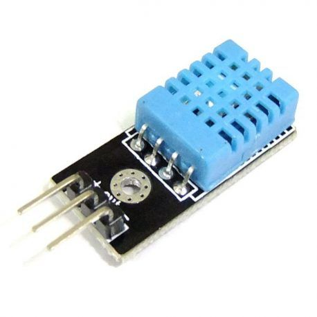
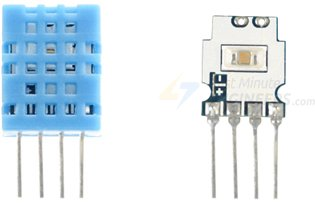
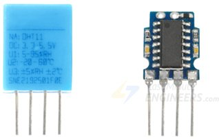
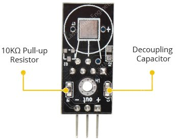
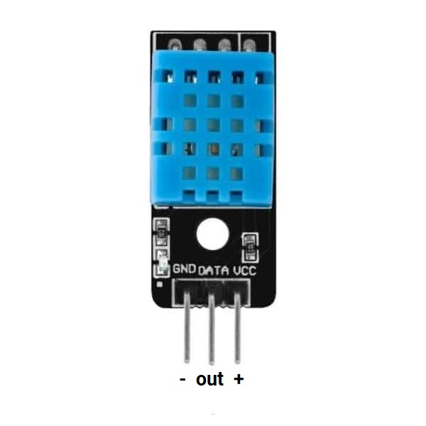
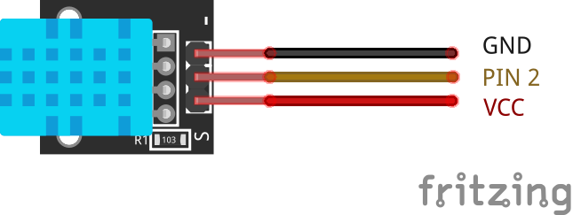

# Utilización del Módulo Sensor de temperatura y humedad DHT11

Nuestro proyecto tendra la capacidad de detectar el mundo que lo rodea con el este Sensor de Temperatura y Humedad DHT11. Este está precalibrado y no requiere componentes adicionales, por lo se que puede comenzar a medir la humedad relativa y la temperatura de inmediato.

## Materiales

Para realizar la conexión con la placa Arduino Mega, necesitaremos:

- 1 Módulo Sensor de Temperatura y Humedad DHT11
- 3 Cables tipo Dupont Macho - Macho

### Módulo Sensor de temperatura y humedad DHT11

DHT11 puede medir la temperatura de 0 °C a 50 °C con una precisión de ± 2.0 °C y la humedad del 20 al 80 % con una precisión del 5%.

Tenga en cuenta que la frecuencia de muestreo del DHT11 es de 1 Hz, lo que significa que puede obtener nuevos datos una vez por segundo.

<figure style="text-align: center">
    
    <figcaption style="text-align: center">Módulo Sensor de temperatura y humedad DHT11</figcaption>
</figure>

#### Descripción

Dentro del DHT11, hay un componente sensor de humedad junto con un termistor.

El componente sensor de humedad tiene dos electrodos con un sustrato de retención de humedad intercalado entre ellos. Los iones son liberados por el sustrato a medida que se absorbe el vapor de agua, lo que a su vez aumenta la conductividad entre los electrodos. El cambio de resistencia entre los dos electrodos es proporcional a la humedad relativa. Una humedad relativa más alta disminuye la resistencia entre los electrodos, mientras que la humedad relativa más baja aumenta la resistencia entre los electrodos.

DHT11 también contiene un NTC/Termistor para medir la temperatura. Un termistor es una resistencia térmica cuya resistencia cambia drásticamente con la temperatura. El término "NTC" significa "Coeficiente de Temperatura Negativo", lo que significa que la resistencia disminuye con el aumento de la temperatura.

<figure style="text-align: center">
    
    <figcaption style="text-align: center">Sensor de temperatura y humedad</figcaption>
</figure>

En el otro lado, hay una pequeña PCB con un Circuito Integrado (CI). Este CI mide y procesa la señal analógica con los coeficientes de calibración almacenados, hace la conversión analógica a digital y transmite una señal digital con la temperatura y la humedad.

<figure style="text-align: center">
    
    <figcaption style="text-align: center">Sensor de temperatura y humedad (Detrás)</figcaption>
</figure>

El módulo viene con todos los circuitos de soporte esenciales, por lo que debería estar listo para funcionar sin ningún componente adicional.

<figure style="text-align: center">
    
    <figcaption style="text-align: center">Circuito de Apoyo</figcaption>
</figure>

Los sensores DHT11 generalmente requieren una **_resistencia pull-up externa de 10KΩ_** entre VCC y el pin de salida para una comunicación adecuada entre el sensor y el Arduino. Sin embargo, el módulo tiene una resistencia pull-up incorporada, por lo que no es necesario que la agregue.

El módulo también tiene un **_condensador de desacoplamiento_** para filtrar el ruido en la fuente de alimentación.

##### Configuración de los Pines

<figure style="text-align: center">
    
    <figcaption style="text-align: center">Pines Módulo Sensor de temperatura y humedad DHT11</figcaption>
</figure>

- **_+ (VCC)_**, el pin suministra energía para el sensor. Se recomienda un suministro de 5V, aunque el voltaje de suministro varía entre 3.3 V y 5.5 V. En el caso de una fuente de alimentación de 5V, se puede mantener el sensor hasta a una distancia de 20 metros. Sin embargo, con una tensión de alimentación de 3.3V, la longitud del cable no debe ser superior a 1 metro. De lo contrario, la caída de voltaje de la línea dará lugar a errores en la medición.
- **_out (DATA)_**, el pin se utiliza para la comunicación entre el sensor y el Arduino.
- **_\- (GND)_**, debe estar conectado a la tierra de Arduino.

#### Más Información

[Modulo Sensor de temperatura y humedad DHT11](https://www.e-ika.com/modulo-sensor-de-temperatura-y-humedad-dht11)
[Modulo Sensor de temperatura y humedad DHT11](https://www.techlookelectronica.com/producto/modulo-sensor-de-temperatura-y-humedad-dht11/)
[DHT11 sensor temperatura y humedad - MakerElectronico](https://www.makerelectronico.com/producto/dht11-sensor-temperatura-humedad/)

## Circuito y Montaje

Comienzaremos conectando el pin + (VCC) a la salida de 5V en el Arduino Mega y conectaremos - (GND) a tierra. Finalmente, conectaremos el pin de salida (out - DATA) al pin digital 2.

El siguiente diagrama le muestra cómo:

<figure style="text-align: center">
    
    <figcaption style="text-align: center">Conexión Módulo Sensor de Humedad y Temperatura</figcaption>
</figure>

## Programación

El sensor DHT11 posee su protocolo propio de comunicaciones, el cual le permite enviar la información por un sólo pin, pero crear el código para la comunicación por este protocolo es mucho trabajo, afortunadamente ya se ha creado una librería para lograrlo.

### Libreria para Sensor DHT

Hay varias librerías que podemos utilizar para obtener la información de temperatura y humedad. En este caso vamos a utilizar la libreria [DHT sensor library](https://www.arduino.cc/reference/en/libraries/dht-sensor-library/) que nos proporciona Adafruit.

La libreria tiene como dependencia la libreria: [Adafruit Unified Sensor](https://www.arduino.cc/reference/en/libraries/adafruit-unified-sensor/)

A continuación algunas de las funciones principales:

- **DHT11** y **DHT22**
  Constantes del tipo de sensor a utilizar (DHT11 o DHT22).
- **DHT(pin, tipo)**
  Función constructor, crea un objeto de la clase DHT, con pin al que estará conectado el sensor y el tipo de sensor.
- **begin()**
  Inicializa el sensor
- **readHumidity()**
  Lee la humedad relativa en porcentaje
- **readTemperature(escala)**
  Lee la temperatura en la escala seleccionada al parar un parametro booleano (true: Fahrenheit y false: Celcius)

### Código

```c++
#include <DHT.h>

// ...

/*
   Variables para el sensor de humedad relativa y de temperatura (SensorHRT):
   1. el pin al que se conecta
   2. el modelo de sensor (DTH11 o DTH22)
*/
byte pinSensorHRT = 2;
#define tipoSensorHRT DHT11
DHT sensorHRT(pinSensorHRT, tipoSensorHRT);

// ...

void setup()
{
   // ...

   sensorHRT.begin();
}

void loop()
{
   lecturasSensores(mumeroLecturasParaObtenerPromedio, valorLecturaTierraSeca);

   // ...
}

void lecturasSensores(int numeroLecturas, float valorLecturaTierraSeca)
{
   // ...

   float humedadRelativa = sensorHRT.readHumidity();
   float temperaturaCelcius = sensorHRT.readTemperature();
   float temperaturaFarentheit = sensorHRT.readTemperature(true);
   boolean lecturasSensorHRTSonValidas = !isnan(humedadRelativa) && !isnan(temperaturaCelcius) && !isnan(temperaturaFarentheit);

   if (millis() - tiempoMilisegundos >= tiempoEntreGuardadoDeLecturasRegistradas || tiempoMilisegundos == 0)
   {
      // ...

      if (miArchivo)
      {
         if (lecturasSensorHRTSonValidas)
         {
            String registro = String(promedioPorcentajesSHS1) + "," + String(promedioPorcentajesSHS2) + "," + String(humedadRelativa) + "," + String(temperaturaCelcius) + "," + String(temperaturaFarentheit) + "," + marcaDeTiempo;
         }
         else
         {
            // ...
         }
        // ...
      }
      else
      {
         // ...
      }
   }

   // ...

}
```

## Referencias

[Proyecto 23 - Módulo sensor DHT11 - Acortes Software](https://acortes.co/proyecto-23-sensor-de-humedad-y-temperatura-dht11/)
[In-Depth: Interface DHT11 Module With Arduino](https://lastminuteengineers.com/dht11-module-arduino-tutorial/)
[Cómo utilizar el DHT11 para medir la temperatura y humedad con Arduino](https://programarfacil.com/blog/arduino-blog/sensor-dht11-temperatura-humedad-arduino/)
[Arduino - Temperature Humidity Sensor | Arduino Tutorial](https://arduinogetstarted.com/tutorials/arduino-temperature-humidity-sensor#content_arduino_code_dht11)
