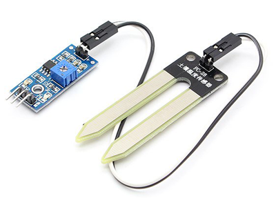
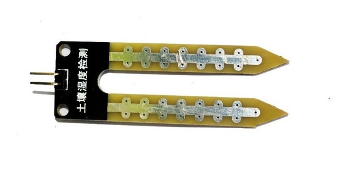
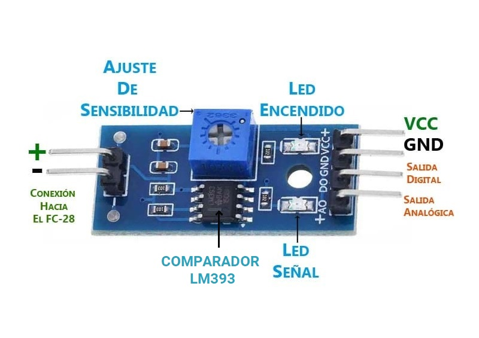
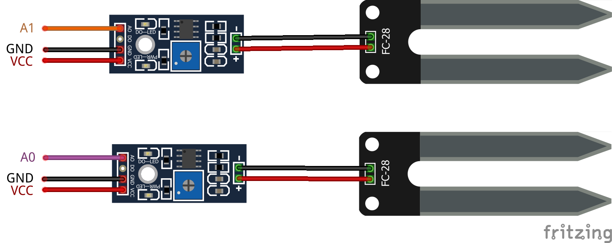
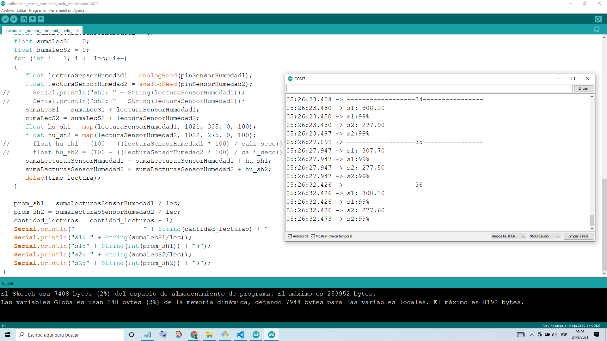

# Utilización del Sensor de Humedad de Suelo

Con este módulo podremos medir la humedad del suelo, de modo que nos permitirá controlar el nivel de humedad de la tierra de nuestros cultivos

## Materiales

Para realizar la conexión con la placa Arduino Mega, necesitaremos:

- 2 Sensores de Humedad de Suelo incluidos 4 Cables tipo Dupont Hembra - Hembra (2 por sensor)
- 6 Cables tipo Dupont Macho - Hembra

### Sensor de Humedad de Suelo

<figure style="text-align: center">
    
    <figcaption style="text-align: center">Sensor de Humedad de Suelo</figcaption>
</figure>

Es un sensor que mide la humedad del suelo. Está formado por dos piezas: la placa electrónica (a la izquierda) y la sonda con dos pads, que detecta el contenido de agua (a la derecha). Será empleado para que el sistema consiga realizar el riego automático al detectar cuando es necesario activar el sistema de bombeo.

El valor concreto de la humedad dependerá del tipo de suelo y la presencia de elementos químicos, como fertilizantes. Además, no todos los cultivos requieren la misma humedad, por lo que lo que se deberá realizar una calibración previa.

#### Descripción

##### La Sonda

<figure style="text-align: center">
    
    <figcaption style="text-align: center">Electrodos Resisistivos (Sonda)</figcaption>
</figure>

El Sensor de humedad de suelo permite medir de forma sencilla la humedad del suelo por medio de 2 **_electrodos resistivos_**.El funcionamiento del sensor se basa en medir la resistencia entre 2 electrodos (sonda) insertados dentro del suelo, la resistencia entre los electrodos dependerá de la humedad del suelo. Esta resistencia es inversamente proporcional a la humedad del suelo:

- Cuanta más agua en el suelo significa mejor conductividad y resultará en una menor resistencia.
- La menor cantidad de agua en el suelo significa una mala conductividad y dará como resultado una mayor resistencia.

El sensor produce un voltaje de salida de acuerdo con la resistencia, que midiendo podemos determinar el nivel de humedad.

##### El Módulo

<figure style="text-align: center">
    
    <figcaption style="text-align: center">Tarjeta de Acondicionamiento</figcaption>
</figure>

El sensor también contiene un módulo electrónico que conecta la sonda al Arduino este entrega una salida digital y otra analógica:

- El módulo produce un voltaje de salida de acuerdo con la resistencia de la sonda y está disponible en un pin de **_salida analógica (AO)_**. Entrega un voltaje analógico desde 0V (0) para un suelo muy húmedo hasta 5V (1023) para un suelo muy seco.
- La misma señal se envía a un **_comparador LM393_** (de alta precisión ) para digitalizarla y está disponible en un pin de salida digital (DO). que se puede regular con el **_potenciómetro_** de la tarjeta (no utilizaremos la señal digital).

##### Configuración de los Pines

- **_VCC_**: Voltaje de alimentación, el pin suministra energía para el sensor. Se recomienda alimentar el sensor entre 3.3V - 5V. Tenga en cuenta que la salida analógica variará según el voltaje que se proporcione al sensor.
- **_GND_**: Tierra (GND 0V), es una conexión a tierra.
- **_D0_**: Salida digital, el pin da salida digital del circuito comparador interno. Puede conectarlo a cualquier pin digital en un Arduino o directamente a un relé de 5V o dispositivo similar.
- **_A0_**: Salida analógica, pin nos da una señal analógica entre el valor de suministro a 0V y se conectará a una de las entradas analógicas en su Arduino.

#### Más Información

[Ardobot Robótica SAS Sensor De Humedad De Suelo Sonda Higrometro YL38 y YL69](https://www.ardobot.co/sensor-de-humedad-de-suelo-sonda-higrometro-yl38-y-yl69.html)
[Sensor de humedad del suelo - Higrómetro para Arduino » IBEROBOTICS](https://www.iberobotics.com/producto/sensor-humedad-del-suelo-higrometro-arduino/)

## Circuito y Montaje

La conexión con nuestra placa Arduino es muy simple, si te fijas, el convertidor tiene dos lados, uno con cuatro pines y otro con dos. El lado de cuatro pines va hacia nuestra placa Arduino, y el lado de dos pines va hacia los electrodos.

Tenemos que conectar el **_pin VCC_** a la alimentación de **_5V_**, que en este caso puede ser de la misma placa Arduino (aunque puede ser de otra fuente, recordando conectar todas las tierras a un mismo nodo). El **_pin GND_** irá conectado a la terminal de tierra de la placa. Y como elegimos el **_modo de salida analógica_**, utilizaremos la salida nombrada como **_A0_**, esta la conectaremos a alguna de las entradas analógicas de la placa Arduino, como se muestra a continuación:

<figure style="text-align: center">
    
    <figcaption style="text-align: center">Conexión Sensores de Humedad de Suelo</figcaption>
</figure>

## Calibración

Para obtener lecturas precisas de su sensor de humedad del suelo, primero debemos realizar su calibración para el tipo particular de suelo que monitorearemos.

Diferentes tipos de suelo pueden afectar al sensor, por lo que los sensores puede ser más o menos sensible según el tipo de suelo que utilicemos ademas debemos ver qué lecturas se obtienen realmente de los mismos.

Utilizamos el siguiente código para observar los valores que emiten nuestros sensores cuando el suelo están lo más seco posible versus cuando están completamente saturados de humedad.

```c++
/*
   Pines para los sensores de humedad
   Los pines para los sensores de humedad de suelo deben ser analógicos
   SH1 -> Sensor de humedad 1
   SH2 -> Sensor de humedad 2
*/
const float pinSH1 = A0;
const float pinSH2 = A1;

/*
   La placa Arduino detectará el nivel de voltaje entregado por el sensor de humedad de suelo, y lo convertirá en un número equivalente a la cantidad de humedad detectada entre 0 y 1023
*/

//Numero de lecturas del sensor de humedad para el promedio
const byte cantidadLecturas = 10;
//tiempo entre cada uno de las lecturas
const byte tiempoEntreCadaLectura = 500;
//tiempo para mostrar los resultados de la lectura
const int tiempoResultados = 2000;

//Variables del promedio de lectura de humedades
float promedioPorcentajeSH1 = 0;
float promedioPorcentajeSH2 = 0;

long cantidadEjecuciones;

void setup()
{
   cantidadEjecuciones = 0;
   Serial.begin(9600);
}

void loop()
{
   //Se llama a procedimiento que promedia las lecturas
   promedio_humedad(cantidadLecturas);
   delay(tiempoResultados);
}

void promedio_humedad(byte cantidad)
{
   float sumaPorcentajeSH1 = 0;
   float sumaPorcentajeSH2 = 0;
   float sumaLecturasSH1 = 0;
   float sumaLecturasSH2 = 0;
   for (int i = 1; i <= cantidad; i++)
   {
      float lecturaSH1 = analogRead(pinSH1);
      float lecturaSH2 = analogRead(pinSH2);
      sumaLecturasSH1 = sumaLecturasSH1 + lecturaSH1;
      sumaLecturasSH2 = sumaLecturasSH2 + lecturaSH2;
      float porcentajeSH1 = map(lecturaSH1, 1021, 305, 0, 100);
      float porcentajeSH2 = map(lecturaSH2, 1022, 275, 0, 100);
      sumaPorcentajeSH1 = sumaPorcentajeSH1 + porcentajeSH1;
      sumaPorcentajeSH2 = sumaPorcentajeSH2 + porcentajeSH2;
      delay(tiempoEntreCadaLectura);
   }

   promedioPorcentajeSH1 = sumaPorcentajeSH1 / cantidad;
   promedioPorcentajeSH2 = sumaPorcentajeSH2 / cantidad;
   cantidadEjecuciones = cantidadEjecuciones + 1;
   Serial.println("------------------" + String(cantidadEjecuciones) + "----------------");
   Serial.println("s1: " + String(sumaLecturasSH1 / cantidad));
   Serial.println("s1:" + String(int(promedioPorcentajeSH1)) + "%");
   Serial.println("s2: " + String(sumaLecturasSH2 / cantidad));
   Serial.println("s2:" + String(int(promedioPorcentajeSH2)) + "%");
}
```

Cuando ejecute el código, se verán cerca de las siguientes lecturas en el monitor en serie:

- cuando el suelo estaba seco (~ 1023)
- cuando el suelo estaba completamente mojado (~ 300)

<figure style="text-align: center">
    
    <figcaption style="text-align: center">Ejecución del Código para la Calibración de los Sensores</figcaption>
</figure>

Esta prueba puede requerir un poco de prueba y error. Una vez que tenga un buen manejo de estas lecturas, puede usarlas como umbral si tiene la intención de desencadenar una acción.

## Programación

Para utilizar los sensores de humedad de suelo no necesitaremos ninguna libreria.

### Código

```c++
// ...
const float pinSHS1 = A0;
const float pinSHS2 = A1;

const int mumeroLecturasParaObtenerPromedio = 10;
const int tiempoEntreLecturasDelPromedio = 500;
const long tiempoEntreLecturasRealizadas = 5000;

float promedioPorcentajesSHS1 = 0;
float promedioPorcentajesSHS2 = 0;

// ...

void setup()
{
    // ...
}

void loop()
{
   lecturasSensores(mumeroLecturasParaObtenerPromedio, valorLecturaTierraSeca);

   // ...
}

void lecturasSensores(int numeroLecturas, float valorLecturaTierraSeca)
{
   float sumaPorcentajesSHS1 = 0;
   float sumaPorcentajesSHS2 = 0;
   for (int i = 1; i <= numeroLecturas; i++)
   {
      float lecturaSHS1 = analogRead(pinSHS1);
      float lecturaSHS2 = analogRead(pinSHS2);
      float porcentajeSHS1 = map(lecturaSHS1, 1021, 305, 0, 100);
      float porcentajeSHS2 = map(lecturaSHS2, 1022, 275, 0, 100);
      sumaPorcentajesSHS1 = sumaPorcentajesSHS1 + porcentajeSHS1;
      sumaPorcentajesSHS2 = sumaPorcentajesSHS2 + porcentajeSHS2;
      delay(tiempoEntreLecturasDelPromedio);
   }
   promedioPorcentajesSHS1 = sumaPorcentajesSHS1 / numeroLecturas;
   promedioPorcentajesSHS2 = sumaPorcentajesSHS2 / numeroLecturas;

   // ...

   if (millis() - tiempoMilisegundos >= tiempoEntreGuardadoDeLecturasRegistradas || tiempoMilisegundos == 0)
   {
      // ...

      if (miArchivo)
      {
         if (lecturasSensorHRTSonValidas)
         {
            String registro = String(promedioPorcentajesSHS1) + "," + String(promedioPorcentajesSHS2) + "," + String(humedadRelativa) + "," + String(temperaturaCelcius) + "," + String(temperaturaFarentheit) + "," + marcaDeTiempo;

            // ...
         }
         else
         {
            // ...
         }
         // ...
      }
      else
      {
         // ...
      }
   }
   // ...

   lcd.print("S1:" + String(int(promedioPorcentajesSHS1)) + "%");

   // ...

   lcd.print("S2:" + String(int(promedioPorcentajesSHS2)) + "%");
   delay(tiempoEntreLecturasRealizadas);

   // ...
}

```

## Referencias

[In-Depth: How Soil Moisture Sensor Works and Interface it with Arduino](https://lastminuteengineers.com/soil-moisture-sensor-arduino-tutorial/)\*
[Sensor de humedad del suelo - Higrómetro para Arduino » IBEROBOTICS](https://www.iberobotics.com/producto/sensor-humedad-del-suelo-higrometro-arduino/)
[Guide for Soil Moisture Sensor YL-69 or HL-69 with the Arduino | Random Nerd Tutorials](https://randomnerdtutorials.com/guide-for-soil-moisture-sensor-yl-69-or-hl-69-with-the-arduino/)
[Medir la humedad del suelo con Arduino y sensor FC-28](https://www.luisllamas.es/arduino-humedad-suelo-fc-28/)
[Cómo utilizar un sensor de humedad de suelo con Arduino](https://www.automatizacionparatodos.com/sensor-de-humedad-de-suelo-con-arduino/)
[Sensor de Humedad del Suelo FC-28](https://naylampmechatronics.com/sensores-temperatura-y-humedad/47-sensor-de-humedad-de-suelo-fc-28.html)
